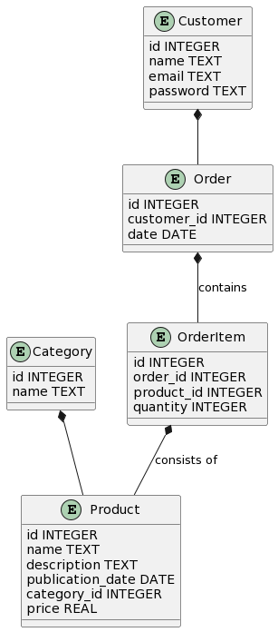

# SQL-Laboutique

code sql pour une boutique quelconque (réutilisable)

## Description

Ces fichiers permettent d'être réutilisable pour un projet de e-commerce ou autre.
J'ai d'abord réaliser visuellement les différentes tables comme sur la capture d'écran ci dessus.
J'ai utilisé par la suite le langage SQL pour créer la base de données mais aussi phpmyadmin.

## Installation

1. Créez d'abord une base de données du nom de votre choix sous phpmyadmin.
2. Cliquez sur importer et séléctionnez le fichier .sql
